# AMIDST Biome Colors Continued
This page lists harmonized biome color definitions for Minecraft tools.

[AMIDST project](https://github.com/toolbox4minecraft/amidst) has stopped development after Minecraft 1.17 update, so there is no common usable color definition to highlight biomes for Minecraft related tools anymore. This is an approach to discuss and harmonize color definitions for new Minecraft biomes from 1.18 onwards. Older Biome color definitions can be found in the  [AMIDST Biome Color Table](https://github.com/toolbox4minecraft/amidst/wiki/Biome-Color-Table).

## Biome Colors
This chapter is work in progress until we have a first agreed color set.
It will have a table like the original AMIDST color definition page.

| Biome name      | Minutor                          | Chunkbase                        | Cubiomes                         |
| --------------- | -------------------------------- | -------------------------------- | ---------------------------------|
| Dripstone Caves | `#c1a58f` 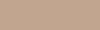 | `#c1a58f`  | `#4e3012` 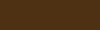
| Lush Caves      | `#df9634` 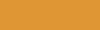 | `#df9634`  | `#283c00` 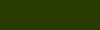
| Meadow          | `#74b77e` 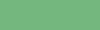 | `#8ca470`  | `#60a445` 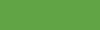
| Grove           | `#47726c`  | `#dfece5` 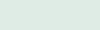 | `#47726c` 
| Snowy Slopes    | `#f2f2f2`  | `#daf1f1` 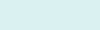 | `#c4c4c4` 
| Jagged Peaks    | `#dfe8e9`  | `#e3eced`  | `#dcdcc8` 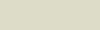
| Stony Peaks     | `#d1d1d1`  | `#d1d1d1`  | `#7b8f74` 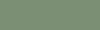
| Frozen Peaks    | `#99b9f2` 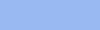 | `#eafbfb`  | `#b0b3ce` 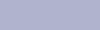
| Deep Dark       | `#101b1b`  | `#000000`  | `#031f29` 
| Mangrove Swamp  | `#24c48e`  | `#24c48e`  | `#2ccc8e` 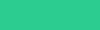
| Cherry Grove    | `#f7b9dc` 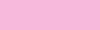 | `#f7b9dc`  | `#ff91c8` 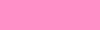

## Supporting Projects
* [Minutor](https://github.com/mrkite/minutor)
* [ChunkBase](https://www.chunkbase.com/apps/biome-finder)
* [Cubiomes](https://github.com/Cubitect/cubiomes) might join

## Contributing
If you want to suggest new or change a biome color definition, just open an issue.

Always try to give a reasoning why this new color should be used. Not only "it looks better to me". E.g. describe a derivation process to get from a typical block or structure of that biome to a new color, or put the biome in relation to similar biomes and their colors.

If you and your project intend to join this color definition, just use it or open an issue to discuss further details.
